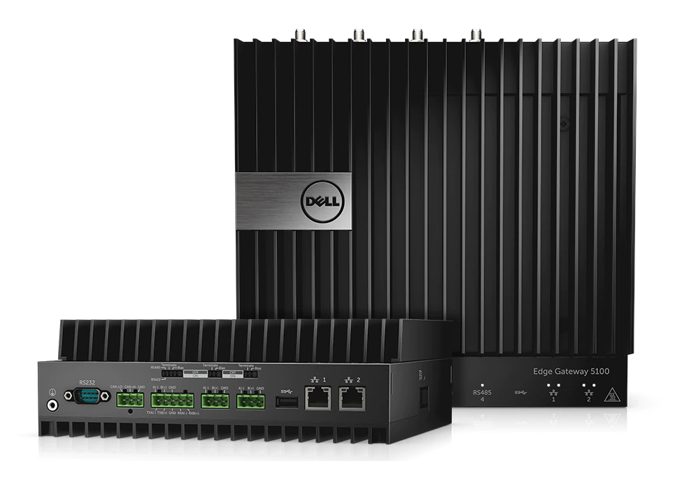
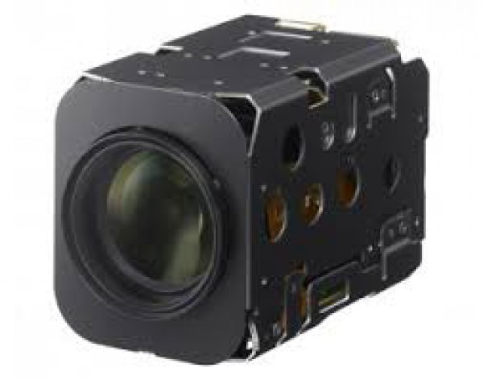
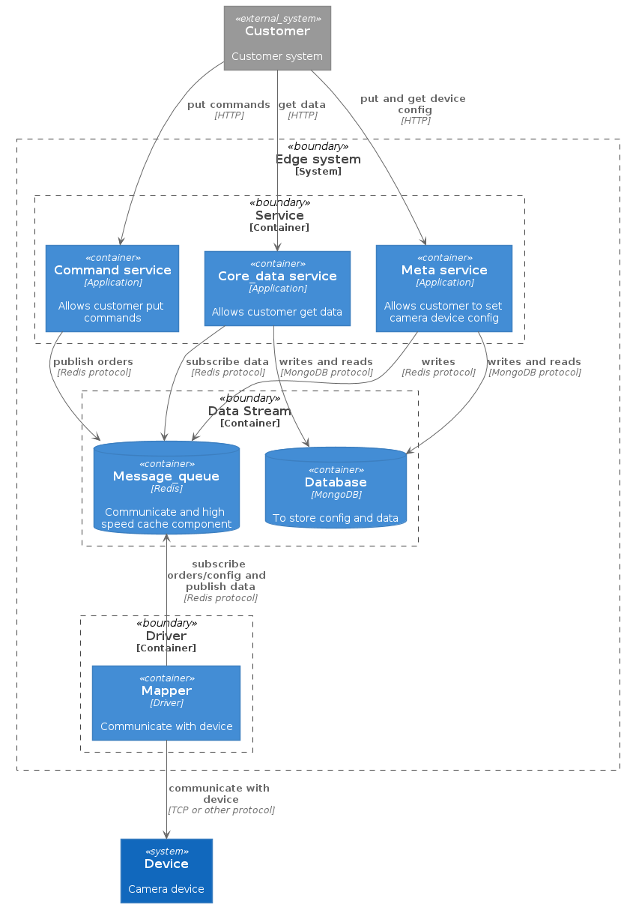

# camera
## 1 概述
相机数采及控制框架。

## 2 硬件组成
1. [边缘网关](https://www.dell.com/en-us/work/shop/cty/pdp/spd/dell-edge-gateway-5100/xctoi5100us)：

2. [sony相机](https://www.aegis-elec.com/sony-fcb-ev7520a-2-13mp-30x-zoom-fhd-block-camera.html)：

   
## 3 数采软件框架
整体软件框架分为三层
1. Service 服务层：主要提供与第三方用户的交互服务，接口为Restful风格http接口
2. Data stream   数据流层：主要为内部各个服务组件提供信息交互以及数据持久化存储服务
3. drivers 设备驱动层：对硬件驱动进行二次封装，提供与硬件交互的服务
### 3.1 Service
1. Command 提供命令http api
2. Coredata 提供数据查询http api
3. Meta    提供设备配置更改与查询http api
### 3.2 Data stream
1.message queue 消息队列：Redis
   - 1.提供本地高速缓存；
   - 2.提供消息队列；

2.database 数据库：MongoDB
   - 1.提供本地数据持久化存储，做历史查询；
   - 2.提供本地配置信息持久化存储
### 3.3 Driver
1. mapper 设备驱动
   - 与物理设备通讯

## 4 系统优点
1. 整个系统向第三方提供Restful风格的HTTP接口，耦合松散，便于集成于其他系统；
2. 采用Redis当作消息队列及缓存，可充分发挥Redis高速缓存的优势，提供实时数据采集及控制服务；
3. 整个系统内部通过消息队列做接口通讯，耦合较为松散，可随时对其中某一模块进行独立开发，便于升级拓展。如驱动层可独立编写，以适配不同的硬件设备。
## 整体系统框图

   